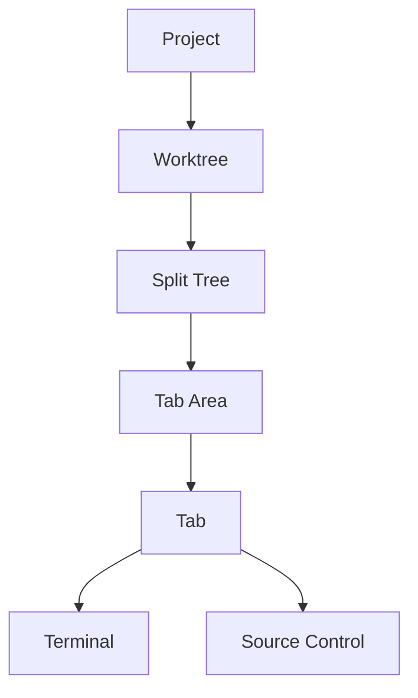

# Muxy Documentation

> **Reading this as an LLM?** Start from <https://muxy.app/llms.txt> — an index of every page that links to its raw Markdown source. Append `/plain` to any docs URL (e.g. <https://muxy.app/docs/extensions/manifest/plain>) for that page's raw Markdown.

Muxy is a native macOS terminal multiplexer organized around projects, worktrees, tabs, and split panes. It also ships a source-control UI and a WebSocket API for companion apps.

## User Guide

| Page | What's in it |
| --- | --- |
| [Getting Started](user-guide/getting-started.md) | Install, add a project, first tabs |
| [Keyboard Shortcuts](user-guide/keyboard-shortcuts.md) | Default bindings, all remappable |
| [Settings](user-guide/settings.md) | Every preference tab explained |
| [Troubleshooting](user-guide/troubleshooting.md) | Logs, common fixes, reset state |

## Feature Guides

| Page | What's in it |
| --- | --- |
| [Projects](features/projects.md) | Add/switch projects, IDE launch, CLI, URL scheme |
| [Project Workspaces](features/project-workspaces.md) | Filter projects into named sidebar workspaces |
| [Worktrees](features/worktrees.md) | Per-worktree workspaces, setup commands |
| [Tabs & Splits](features/tabs-and-splits.md) | Tab kinds, splits, drag & drop, pinning |
| [Terminal](features/terminal.md) | Ghostty config, find, copy/paste, custom commands |
| [Rich Input](features/rich-input.md) | Multiline prompts, files, images, broadcast send |
| [Voice Recording](features/voice-recording.md) | Dictate text into Muxy from the status bar |
| [Source Control](features/source-control.md) | Git status, diff, branches, pull requests |
| [Notification Setup](features/notifications.md) | OSC sequences, hooks, socket API |
| [AI Assistant](features/ai-assistant.md) | Draft commit messages and PR text from diffs |
| [Themes](features/themes.md) | Theme picker and Ghostty config |
| [Muxy CLI](features/muxy-cli.md) | Open projects and control workspaces from a terminal, plus an AI agent skill |

## Layouts

| Page | What's in it |
| --- | --- |
| [Layouts Overview](layouts/overview.md) | Declarative `.muxy/layouts/*.yaml` workspaces |
| [Layout Schema](layouts/schema.md) | Fields, single panes, split trees, JSON form |
| [Layout Examples](layouts/examples.md) | Ready-to-adapt layout recipes |

## Extensions

> **DEV — under active development.** APIs and manifest format may change.

**Start here**

| Page | What's in it |
| --- | --- |
| [Get started](extensions/get-started.md) | Build and run your first extension in ~2 minutes |
| [Extensions Overview](extensions/overview.md) | Architecture, lifecycle, security model |
| [Manifest](extensions/manifest.md) | `package.json` `muxy` fields, subprocess environment |
| [Permissions](extensions/permissions.md) | What each permission grants |

**Build UI**

| Page | What's in it |
| --- | --- |
| [Extension Tabs](extensions/tabs.md) | Render a full tab as a webview, `window.muxy` bridge |
| [Extension Panels](extensions/panels.md) | Docked or floating webview beside the workspace |
| [Extension Popovers](extensions/popovers.md) | Transient webview anchored to a topbar or status bar item |
| [Topbar Items](extensions/topbar.md) | Add an icon to the tab-strip button cluster |
| [Status Bar Items](extensions/statusbar.md) | Add an icon (with text) to the footer status bar |
| [Extension Modal](extensions/modal.md) | Native searchable picker overlay |
| [Extension Dialogs](extensions/dialogs.md) | Native confirm and alert sheets on the main window |
| [Palette Commands](extensions/palette-commands.md) | Register palette commands, react to triggers |
| [Inline Scripts (`runScript` Commands)](extensions/scripts.md) | `runScript` commands in an in-process JS context |

**Work with the workspace**

| Page | What's in it |
| --- | --- |
| [Events](extensions/events.md) | Workspace events plus extension-local emit/subscribe |
| [Git](extensions/git.md) | `muxy.git` verbs against the active worktree |
| [Files](extensions/files.md) | `muxy.files` reads/writes relative to the worktree root |
| [Settings](extensions/settings.md) | Typed settings with their own Settings sidebar row |
| [Remote Methods](extensions/remote-methods.md) | Serve named API methods to the Muxy mobile app |
| [Extension Logs](extensions/logs.md) | Per-extension log files and where they live |

**Publish**

| Page | What's in it |
| --- | --- |
| [Contributing an extension](extensions/contributing.md) | Fork, validate, and publish an extension |

## Agent Skills

Muxy ships two [skills.sh](https://www.skills.sh) skills that teach coding agents its conventions. Install either into a project with `npx skills add`:

| Skill | What it teaches | Install |
| --- | --- | --- |
| `muxy-cli` | Driving the workspace from a shell — see [Muxy CLI](features/muxy-cli.md) | `npx skills add github.com/muxy-app/muxy/tree/main/Muxy/Resources/skills/muxy-cli` |
| `muxy-extension` | Authoring extensions — see [Get started](extensions/get-started.md) | `npx skills add github.com/muxy-app/muxy/tree/main/Muxy/Resources/skills/muxy-extension` |

## Remote Server

| Page | What's in it |
| --- | --- |
| [Remote Server Overview](remote-server/overview.md) | WebSocket API for mobile clients |
| [Setup & Security](remote-server/setup.md) | Enable the server, port, security model |
| [Pairing & Authentication](remote-server/pairing.md) | Authenticate, pair, register flow |
| [Protocol](remote-server/protocol.md) | Message envelope, request/response/event |
| [API Methods](remote-server/methods.md) | Every RPC method and its parameters |
| [Events](remote-server/events.md) | Server-pushed events and their payloads |
| [Data Objects](remote-server/data-objects.md) | Project, worktree, workspace, notification, terminal snapshot |
